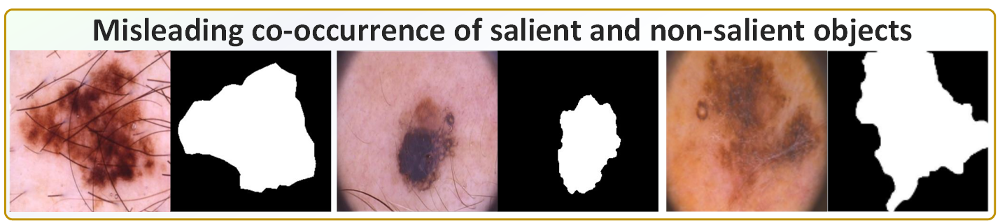
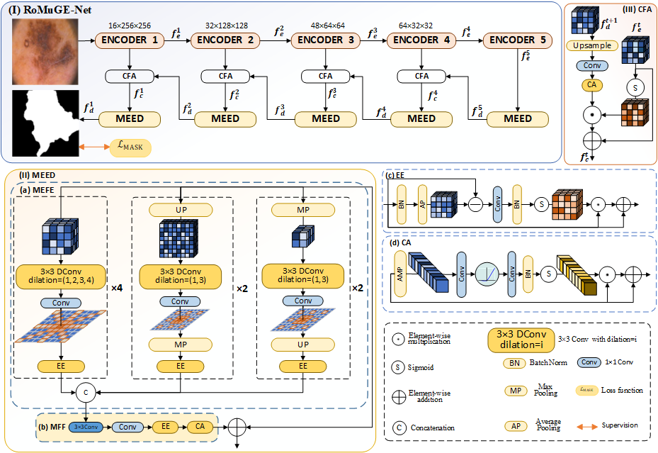
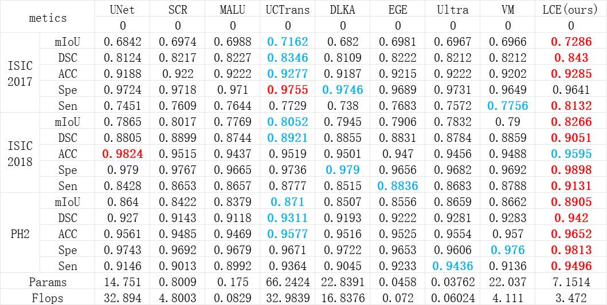
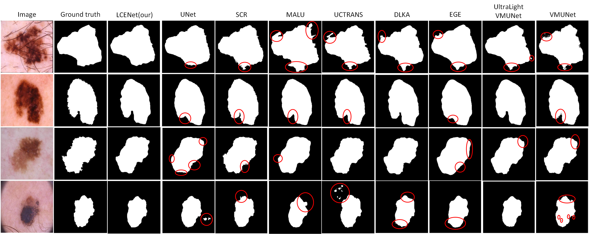

# RoMuGE-Net: Robust Skin Lesion Segmentation with Multi-Granularity Edge Enhancement

🎈 News

[2025.4.25] Training and inference code released

⭐ Abstract

Medical image segmentation is crucial for clinical diagnosis and treatment planning, yet it encounters a major challenges - the misleading co-occurrence of salient and non-salient objects, coupled with noise interference at object boundaries. These issues makes accurate segmentation of salient objects particularly challenging. To overcome these challenges, we propose RoMuGE-Net, a network designed to enhance medical image segmentation. RoMuGE-Net adopts the Multi-scale Edge Enhancement Decoder (MEED), aiming to advanced efficient multi-scale convolution and edge enhancement strategy to comprehensively suppress noise introduced by non-salient regions and highlight critical salient regions. Meanwhile, the MEED use efficient attention mechanism to further enhance the model's accuracy to distinguishing salient and non-salient objects. Plus, our Cross-layer Feature Alignment (CFA) efficiently capture critical segmentation features from deep semantic information and shallow texture details. Extensive experiments on 3 medical image datasets confirm RoMuGE-Net's superior performance, highlighting its potential in the field of medical image segmentation.

🚀 Introduction

<div align="center">

</div>

The challenges: Salient and non-salient objects often exhibit misleading co-occurrence phenomena.

📻 Overview

<div align="center">

</div>

Illustration of the overall architecture.

🎮 Getting Started

1. Install Environment

```
conda create -n RoMuGE python=3.8
conda activate RoMuGE
pip install torch==1.13.0 torchvision==0.14.0 torchaudio==0.13.0 --extra-index-url https://download.pytorch.org/whl/cu117
pip install packaging
pip install timm==0.4.12
pip install pytest chardet yacs termcolor
pip install submitit tensorboardX
pip install triton==2.0.0
pip install causal_conv1d==1.0.0  # causal_conv1d-1.0.0+cu118torch1.13cxx11abiFALSE-cp38-cp38-linux_x86_64.whl
pip install mamba_ssm==1.0.1  # mmamba_ssm-1.0.1+cu118torch1.13cxx11abiFALSE-cp38-cp38-linux_x86_64.whl
pip install scikit-learn matplotlib thop h5py SimpleITK scikit-image medpy yacs
```

2. Prepare Datasets

- Download datasets: ISIC2017 from this [link](https://challenge.isic-archive.com/data/#2017), ISIC2018 from this [link](https://challenge.isic-archive.com/data/#2018), and PH2 from this [link](https://www.dropbox.com/scl/fi/epzcoqeyr1v9qlv/PH2Dataset.rar?rlkey=6mt2jlvwfkditkyg12xdei6ux&e=1).

- Folder organization: put ISIC2017 datasets into ./data/ISIC2017 folder, ISIC2018 datasets into ./data/ISIC2018 folder, and PH2 datasets into ./data/PH2 folder.
  
3. Train the Net

```
python train.py --datasets ISIC2018 --backbone UltraLight_VM_UNet
training records is saved to ./log folder
pre-training file is saved to ./checkpoints/UltraLight_VM_UNet
concrete information see ./LCENet/train.py, please
```

3. Test the RoMER-UNet

```
python test.py --datasets ISIC2018 --backbone UltraLight_VM_UNet
testing records is saved to ./log
testing results are saved to ./Test/UltraLight_VM_UNet/images
concrete information see ./LCENet/test.py, please
```
  
✨ Quantitative comparison

<div align="center">

</div>

Performance comparison with ten SOTA methods on 3 medical image datasets.

🖼️ Visualization

<div align="center">

</div>

We compare our method against 8 state-of-the-art methods. The red box indicates the area of incorrect predictions.

## 8. Acknowledgement:

Thanks to UltraLight-VM-UNet for his outstanding works.

🎫 License
The content of this project itself is licensed under [LICENSE](https://github.com/Submission2025/RoMuGE-Net?tab=Apache-2.0-1-ov-file).
